 

### Game developer · Python developer · Systems builder

Я создаю игры, ботов, серверные системы и собственные инструменты.  
Здесь — рабочие проекты, прототипы, эксперименты.

 

---

---

## `00 // WHAT_I_BUILD`

- Разработка игр и игровых систем на Godot
- Python-боты и серверная логика
- Клиент-серверная архитектура и WebSocket
- Telegram Mini Apps
- Docker, Linux, Windows и сетевые сервисы
- Blender-инструменты и автоматизация пайплайна
- Оптимизация UX и производительности

---

## `01 // PROJECTS`

| Project | Description | Status |
|---|---|---|
| **NAME** | Souls-like action RPG on Godot | `BUILDING` |
| **QUIET LAB** | Набор приложений и AI-инструментов | `IN DEVELOPMENT` |
| **Modular Builder 3.1** | Генератор модульных зданий для Blender | `PROTOTYPE` |
| [**@FreeDownloadAnyServiceBot**](https://t.me/FreeDownloadAnyServiceBot) | Загрузка видео с разных сервисов | `ONLINE` |
| [**@ToxicVerdictBot**](https://t.me/ToxicVerdictBot) | Бот-судья с токсичными вердиктами | `ONLINE` |
| [**@HookWarsBot**](https://t.me/HookWarsBot) | Telegram Mini App: 1 hook = 1 kill | `ONLINE` |
| [**@filetoolskitbot**](https://t.me/filetoolskitbot) | Инструменты для PDF, Word, Excel и изображений | `ONLINE` |
| [**@LootSignalBot**](https://t.me/LootSignalBot) | Уведомления о скидках на игры | `ONLINE` |

---

`CREATE → BREAK → REBUILD → SHIP`

